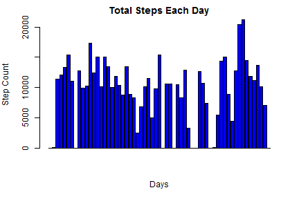
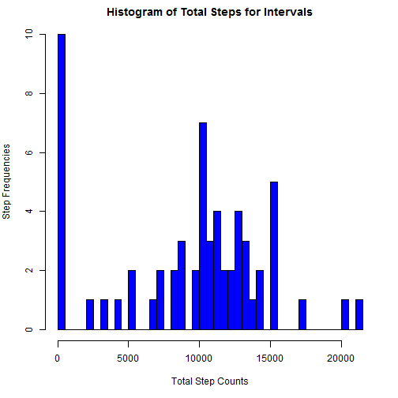
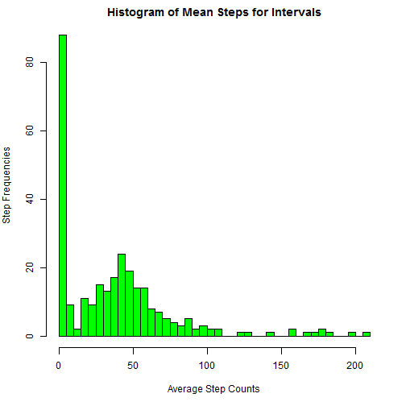
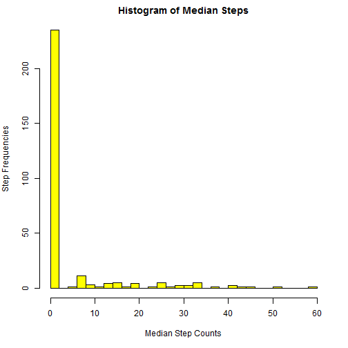
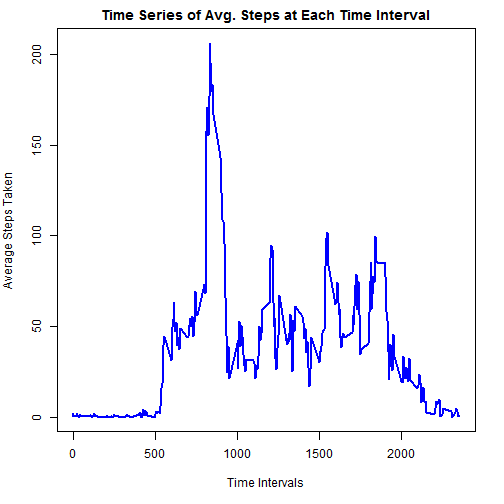
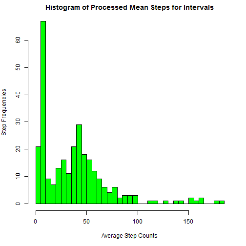
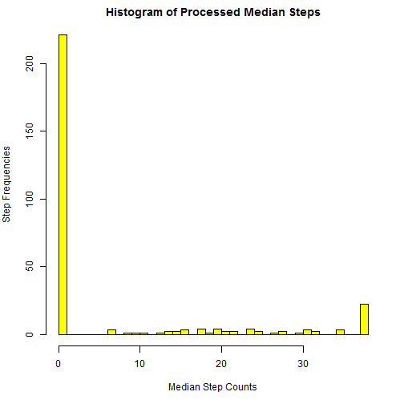
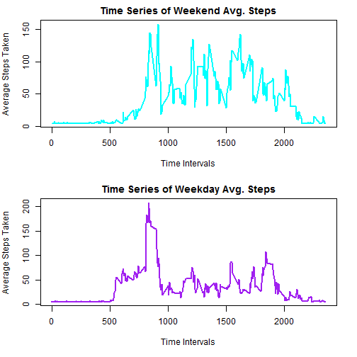

Reproducible Research: Peer Assessment 1
=========================================

#### Loading and preprocessing the data

```r
    library(xtable)

    setwd("~/GitHub/RepData_PeerAssessment1")
    
    rawdata <- read.csv("activity.csv", na.strings=c("NA"))
    
    ## convert dates to date format
    rawdata$date <- as.Date(as.character(rawdata$date))

    ## Section to compute weekday/weekend for one of the problems
    ## declare function to test for weekday or weekend or an input date
    wkEndFcn <- function (inpDt) {
        tmpDay <- weekdays(inpDt) 
        if((tmpDay == "Saturday") || (tmpDay == "Sunday")) 
            return("weekend")
        else
            return("weekday")     
    }

    ### declare column
    DOW <- character(nrow(rawdata))

    ## for loop to do the work
    for (i in 1:nrow(rawdata)) {
        DOW[i] <- wkEndFcn(rawdata$date[i])
    }
 
    # combine factor data with raw data to create a new processed dataset
    procdata <- cbind(rawdata, DOW)
```

_____________________________________________________________________


### Background Information of activity data:


```r
    xt_sum <- xtable(summary(rawdata))
    print(xt_sum, type="html")
```

<!-- html table generated in R 3.1.1 by xtable 1.7-3 package -->
<!-- Sun Aug 17 16:04:14 2014 -->
<TABLE border=1>
<TR> <TH>  </TH> <TH>     steps </TH> <TH>      date </TH> <TH>    interval </TH>  </TR>
  <TR> <TD align="right"> 1 </TD> <TD> Min.   :  0.0   </TD> <TD> Min.   :2012-10-01   </TD> <TD> Min.   :   0   </TD> </TR>
  <TR> <TD align="right"> 2 </TD> <TD> 1st Qu.:  0.0   </TD> <TD> 1st Qu.:2012-10-16   </TD> <TD> 1st Qu.: 589   </TD> </TR>
  <TR> <TD align="right"> 3 </TD> <TD> Median :  0.0   </TD> <TD> Median :2012-10-31   </TD> <TD> Median :1178   </TD> </TR>
  <TR> <TD align="right"> 4 </TD> <TD> Mean   : 37.4   </TD> <TD> Mean   :2012-10-31   </TD> <TD> Mean   :1178   </TD> </TR>
  <TR> <TD align="right"> 5 </TD> <TD> 3rd Qu.: 12.0   </TD> <TD> 3rd Qu.:2012-11-15   </TD> <TD> 3rd Qu.:1766   </TD> </TR>
  <TR> <TD align="right"> 6 </TD> <TD> Max.   :806.0   </TD> <TD> Max.   :2012-11-30   </TD> <TD> Max.   :2355   </TD> </TR>
  <TR> <TD align="right"> 7 </TD> <TD> NA's   :2304   </TD> <TD>  </TD> <TD>  </TD> </TR>
   </TABLE>


The overall mean value for steps is: **37.3826**

The overall median value for steps is: **0**

Note: there are **2304** missing values from the raw data


```r
    day_tot_steps <- aggregate(rawdata$steps, list(day=rawdata$date), FUN=sum, na.rm=TRUE)

    par(mfrow = c(1, 1), mar = c(5, 4, 2, 2))
    barplot(day_tot_steps$x, col="blue", main="Total Steps Each Day", ylab="Step Count", xlab="Days" )
```

 

**N.B.** Bar chart above shows eight days are missing data

_____________________________________________________________________


### What is mean total number of steps taken per day?

```r
    par(mfrow = c(1, 1), mar = c(5, 4, 2, 2))
    hist(day_tot_steps$x, breaks=40, col = "blue", xlab="Total Step Counts", ylab="Step Frequencies", main="Histogram of Total Steps for Intervals")  
```

 


####           Chart of Mean Frequencies for Intevals

```r
##  Create mean step counts for time intervals to create  histogram
    int_mean_steps <- aggregate(rawdata$steps, list(interval=rawdata$interval), FUN=mean, na.rm=TRUE)

    par(mfrow = c(1, 1), mar = c(5, 4, 2, 2))
    hist(int_mean_steps$x, breaks=40, col = "green", xlab="Average Step Counts", ylab="Step Frequencies", main="Histogram of Mean Steps for Intervals")  
```

 


####          Chart of Median Frequencies for Intervals

```r
##  Create mean step counts for time intervals to create  histogram
    int_median_steps <- aggregate(rawdata$steps, list(interval=rawdata$interval), FUN=median, na.rm=TRUE)

    par(mfrow = c(1, 1), mar = c(5, 4, 2, 2))
    hist(int_median_steps$x, breaks=40, col = "yellow", xlab="Median Step Counts", ylab="Step Frequencies", main="Histogram of Median Steps")  
```

 


### What is the average daily activity pattern?

```r
##  Aggregate data for intervals to create frequency time series
    int_mean_steps <- aggregate(rawdata$steps, list(interval=rawdata$interval), FUN=mean, na.rm=TRUE)

# Find Time Interval for maximum step activity
    max_mean_steps <- int_mean_steps[int_mean_steps$x == max(int_mean_steps$x),]

    par(mfrow = c(1, 1), mar = c(5, 4, 2, 2))
    plot(int_mean_steps$interval, int_mean_steps$x, type="l", col = "blue", lwd=2, xlab="Time Intervals", ylab="Average Steps Taken", main="Time Series of Avg. Steps at Each Time Interval")  
```

 

#### The maximum average steps is: **206** which occured at interval:  **835**

### Imputing missing values

```r
## Create function to replace NA values in data with an average from the rawdata
##  Function could be enhanced to take averages from near neighbors of the missing values and factor in time of day and day of week
    imputeVal <- function(inpSteps) {
        replace(inpSteps, is.na(inpSteps), mean(rawdata$steps, na.rm = TRUE))
    }

  ## replace missing values in processed dataset created in first step
    procdata$steps <- imputeVal(rawdata$steps)

######

##  Create mean step counts for time intervals to create  histogram
    int_mean_steps <- aggregate(procdata$steps, list(interval=procdata$interval), FUN=mean, na.rm=TRUE)

## N.B. Charted with identical params as raw data to avoid visualization difference
    par(mfrow = c(1, 1), mar = c(5, 4, 2, 2))
    hist(int_mean_steps$x, breaks=40, col = "green", xlab="Average Step Counts", ylab="Step Frequencies", main="Histogram of Processed Mean Steps for Intervals")  
```

 

```r
##  Create mean step counts for time intervals to create  histogram
    int_median_steps <- aggregate(procdata$steps, list(interval=procdata$interval), FUN=median, na.rm=TRUE)

## N.B. Charted with identical params as raw data to avoid visualization difference
    par(mfrow = c(1, 1), mar = c(5, 4, 2, 2))
    hist(int_median_steps$x, breaks=40, col = "yellow", xlab="Median Step Counts", ylab="Step Frequencies", main="Histogram of Processed Median Steps")  
```

 

Note: Processed data has:  **0** missing values 

Charts for mean and median processed data appear very similar in shape and contours as those with the rawdata with missing values.  There are slight bump in the median data around the substituted average value. Mean data show a similar bump around the substituted value as well, but not as noticable as with the median data. These artifacts could be reduced by using a more sophisticated value imputation function.  


### Are there differences in activity patterns between weekdays and weekends?

```r
# Using procdata dataset from above which removed missing values

## subset data for weekends based on DOW column added in first section
    weekendData <- procdata[(procdata$DOW == "weekend"),]
##  Aggregate data for intervals to create frequency time series
    int_weekend_steps <- aggregate(weekendData$steps, list(interval=weekendData$interval), FUN=mean)

# Find Time Interval for maximum step activity for weekend
    max_weekend_steps <- int_weekend_steps[int_weekend_steps$x == max(int_weekend_steps$x),]


## subset data for weekdays
    weekdayData <- procdata[(procdata$DOW == "weekday"),]
    int_weekday_steps <- aggregate(weekdayData$steps, list(interval=weekdayData$interval), FUN=mean)

# Find Time Interval for maximum step activity for weekday
    max_weekday_steps <- int_weekday_steps[int_weekday_steps$x == max(int_weekday_steps$x),]

    par(mfrow = c(2, 1), mar = c(5, 4, 2, 2))
    plot(int_weekend_steps$interval, int_weekend_steps$x, type="l", col = "cyan", lwd=2, xlab="Time Intervals", ylab="Average Steps Taken", main="Time Series of Weekend Avg. Steps")  

    plot(int_weekday_steps$interval, int_weekday_steps$x, type="l", col = "purple", lwd=2, xlab="Time Intervals", ylab="Average Steps Taken", main="Time Series of Weekday Avg. Steps")  
```

 

The maximum weekend average steps is: **158** which occured at interval:  **915**

The maximum weekday average steps is: **208** which occured at interval:  **835**

Yes, there are differences between weekday and weekend activity levels as well as different time of day for peak steps.
